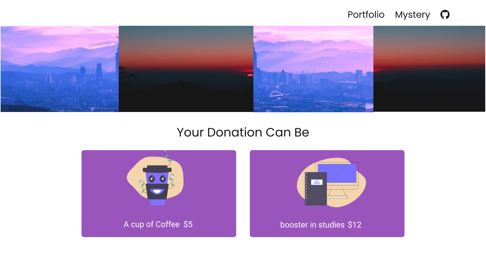
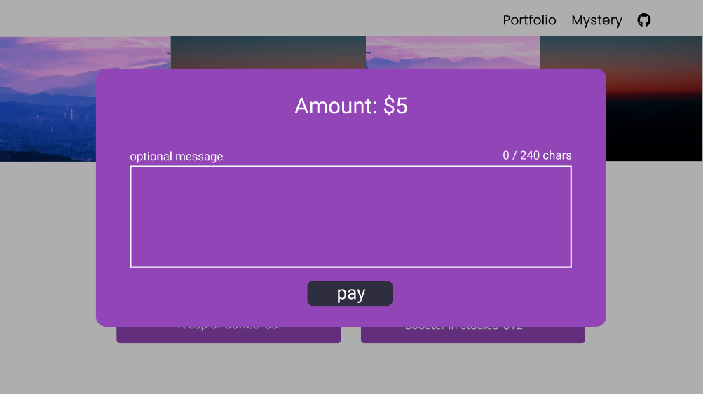

## rootzupport

A **stripe** x **nextJs** project as an implementation of Donation / support me page.

>   alternative to `Buy me a coffee`, made by *yours truly*

figma design [here](https://www.figma.com/file/We5Rw9527qZNjQVqh2va1G/rootzupport?node-id=0%3A1) by [nik](https://www.twitter.com/iamn1khil)

inspirational color [palette](https://colorhunt.co/palette/4c3f919145b6b958a5ff5677) 

### preview

---

https://stackoverflow.com/questions/55943773/stripe-api-error-received-unknown-parameter-source

read this later

### TODO

* make modal functional with card and position it properly.

* create `/success` and `/cancel` page coz after payment, user is going to redirect to one of these.

* future feature: create custom page for logging payment and msg within the application somehow!
